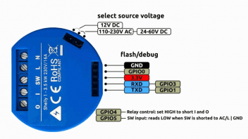

# homebridge-shelly Plugin

`homebridge-shelly` is a [Homebridge](https://github.com/nfarina/homebridge) plugin with which you can switch ON/OFF the Shelly-device via Apple HomeKit.

The plugin is based on the common REST-API of the Shelly-device:  [Rest-API-Documentation](http://shelly-api-docs.shelly.cloud/#shelly-family-overview)


## Hardware (Switch-Actor)

`homebridge-shelly` supports currently only the [Shelly1](https://shelly.cloud/shelly1-open-source/), which is a normal stateful switch with an API-web-access:



Attention:  In case this switch is flashed with the [Tasmota](https://github.com/arendst/Sonoff-Tasmota/wiki/Commands) firmware, this plugin is currently **NOT** supporting this firmware.

It is planned to support further Shelly-components as well....

## Installation

First of all you need to have [Homebridge](https://github.com/nfarina/homebridge) installed. Refer to the according README.md of this repository for instructions.  

Then run the following command to install `homebridge-shelly`:

```
sudo npm install -g homebridge-shelly
```

## Configuration Params

In your central configuration `config.json` of your homebridge environment you can configure this plugin as a normal accessory.

Name of accessory: `shelly`
 
|        Parameter       |                                     Description                                     | Required |
| -----------------------| ----------------------------------------------------------------------------------- |:--------:|
| `name`                 | name of the accessory (also taken to call in "Siri"                                                              |     ✓    |
| `servicetype`          | *default *`Switch`<br> also possible: `Outlet` or `Lightbulb` or `Fan`                                                          |     ✓    |
| `url`                  | url of the actor is receiving these requests                                        |     ✓    |
| `channel`     | *default* `0` <br> (later with Shelly2 planned for `0` or `1`)                                                                  |          |
| `password`             | password for request (no username, because `admin` as default) - in case this attribute is provided, the access is done via security mode                                                          |          |
| `debug`     | if `true`, more logging statements are shown                                                                   |          |


Example of configuration:

```json
{
    "accessories": [
        {
          "accessory": "shelly",
          "name": "Shelly Lamp",
          "servicetype": "Lightbulb",
          "url": "http://localhost",
          "channel": 0,
          "debug": true
        }   
    ]
}
```

## Functionality

Currently the main purpose of this actor (Shelly1) is implemented straight forward into this homebridge plugin.  

Therefore the main purpose is to switch something *on* or *off* - nothing more, nothing less.  In the future further functionality might follow.

It is expected that the actor is configures before using this plugin.  E.g. you can configure the behaviour on "power-on" situatons - but this is done in the setup of the actor (and not within this plugin).


--------------------

## Links

* [Homebridge](https://github.com/nfarina/homebridge)
* [Shelly1](https://shelly.cloud/shelly1-open-source/)
* [Shelly Commands](http://shelly-api-docs.shelly.cloud/#shelly-family-overview)
* [Tasmota-Commands](https://github.com/arendst/Sonoff-Tasmota/wiki/Commands)
* [Shelly1 german forum](http://forum.creationx.de/forum/index.php?thread/980-shelly-1-open-source-wi-fi-switch/)

## Copyright
[MIT](LICENCE.txt) - developed by Henner Harnisch (2018)

<br>

------------------------


## TODO - something for later releases... ;-)

* Maybe for the Shelly2 we could include a engery service ...
* include Shelly2 - tested (currently not possible - because no device available)

### Relay Modus

Maybe define relay modus in configuration and during startup the plugin configures the device accordingly...?


### Support for Tasmota

The Idea would be:  In case the switch is flashed with the [Tasmota](https://github.com/arendst/Sonoff-Tasmota/wiki/Commands) firmware, this plugin is supporting this firmware as well.

### Reverse Stateless Switch

Since **ON** is the only possible state you do not need to declare `onUrl` and `statusUrl`

```json
{
    "accessories": [
        {
          "accessory": "HTTP-SWITCH",
          "name": "Switch",
          
          "switchType": "stateless-reverse",
          
          "timeout": 1000,
          
          "offUrl": "http://localhost/api/switchOff"
        }   
    ]
}
```

### Multiple On or Off Urls
If you wish to do so you can specify an array of urls or urlObjects (`onUrl` or `offUrl`) when your switch is a 
**stateless switch** or a **reverse-stateless switch**.  
**This is not possible with a normal stateful switch.**

Blow are two example configurations of an stateless switch with three urls. 
One is using simple string array and the other is using simple urlObject arrays. 

```json
{
    "accessories": [
        {
          "accessory": "HTTP-SWITCH",
          "name": "Switch",
          
          "switchType": "stateless",
          "onUrl": [
            "http://localhost/api/switch1On",
            "http://localhost/api/switch2On",
            "http://localhost/api/switch3On"
          ]
        }   
    ]
}
```

### MQTT ....?
[MQTT with HomeBridge](https://www.jannikarndt.de/blog/2018/01/how_to_use_a_raspberry_pi_3_with_apple_home/)


### Documentation
JavaScript Doc via [http://apidocjs.com/](http://apidocjs.com/)

